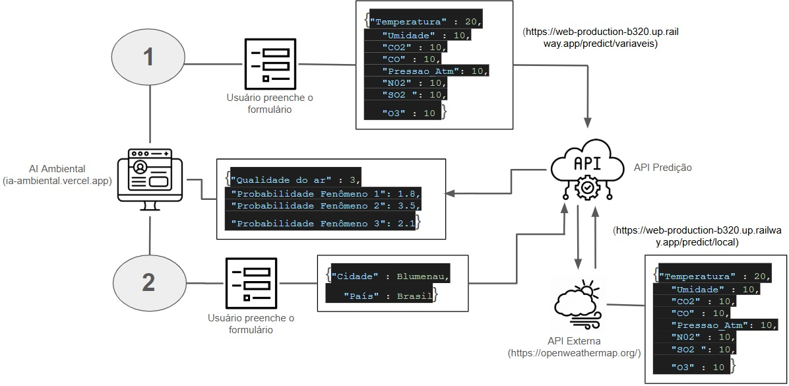

# DESAFIO FINAL - APRENDIZAGEM DE MÁQUINA

Este projeto é destinado apenas para fins educacionais. Os dados exibidos são apenas ilustrativos e podem não corresponder a situações reais.

# IA Ambiental - Previsão de Qualidade do Ar

Este projeto consiste em uma aplicação web que utiliza um modelo de Machine Learning para prever a qualidade do ar com base em dados ambientais. A solução possui duas formas de interação: fornecendo os dados manualmente ou informando uma localidade para que os dados sejam coletados em tempo real de uma API externa.

[](https://ia-ambiental.vercel.app/solucao)
[](https://web-production-b320.up.railway.app/docs)

---

## Arquitetura e Fluxos

A aplicação é composta por um frontend (IA Ambiental) que consome uma API de predição. Essa API, por sua vez, pode interagir com uma API externa (OpenWeatherMap) para obter dados meteorológicos e de poluentes de uma localidade específica.

O diagrama abaixo ilustra o fluxo de dados e as interações entre os componentes:



**Detalhes dos Fluxos:**

1.  **Predição por Variáveis (Fluxo 1):**
    * O usuário preenche um formulário no frontend da IA Ambiental com valores específicos para `Temperatura`, `Umidade`, `CO2`, `CO`, `Pressao_Atm`, `NO2`, `SO2` e `O3`.
    * Esses dados são enviados como uma requisição `POST` para o endpoint `/predict/variaveis` da API de Predição.
    * A API de Predição processa esses dados utilizando seu modelo de Machine Learning e retorna o resultado da "Qualidade do ar" e as "Probabilidades de Fenômeno" para o frontend.

2.  **Predição por Localidade (Fluxo 2):**
    * O usuário preenche um formulário no frontend da IA Ambiental com a `Cidade` e o `País` desejados.
    * Esses dados são enviados como uma requisição `GET` para o endpoint `/predict/local` da API de Predição.
    * A API de Predição, então, faz uma requisição para a API Externa (OpenWeatherMap) usando a cidade e o país fornecidos para obter os dados ambientais em tempo real (temperatura, umidade, pressão atmosférica e poluentes).
    * Com os dados obtidos da API externa, a API de Predição utiliza seu modelo de Machine Learning para calcular a "Qualidade do ar" e as "Probabilidades de Fenômeno", retornando o resultado para o frontend.

---

## Links Úteis

* **Aplicação em Produção**: [https://ia-ambiental.vercel.app/solucao](https://ia-ambiental.vercel.app/solucao)
* **Documentação da API (Swagger)**: [https://web-production-b320.up.railway.app/docs](https://web-production-b320.up.railway.app/docs)
* **API Externa Utilizada**: [https://openweathermap.org/](https://openweathermap.org/)

---

## Como Começar (Executando Localmente)

Siga os passos abaixo para clonar, instalar as dependências e executar o projeto da API de predição em sua máquina local.

### Pré-requisitos

* [Git](https://git-scm.com/)
* [Python](https://www.python.org/downloads/) (versão 3.8 ou superior recomendada)
* `pip` (geralmente instalado com o Python)

### Instalação e Execução

1.  **Clone o repositório:**
    ```bash
    git clone [https://github.com/emanoelsp/desfinal-aprendizagemdemaquina.git](https://github.com/emanoelsp/desfinal-aprendizagemdemaquina.git)
    ```

2.  **Navegue até o diretório do projeto:**
    ```bash
    cd desfinal-aprendizagemdemaquina
    ```

3.  **(Opcional, mas recomendado) Crie e ative um ambiente virtual:**
    * No Windows:
        ```bash
        python -m venv venv
        .\venv\Scripts\activate
        ```
    * No macOS/Linux:
        ```bash
        python3 -m venv venv
        source venv/bin/activate
        ```

4.  **Instale as dependências necessárias:**
    ```bash
    pip install -r requirements.txt
    ```

5.  **Execute a aplicação (API):**
    O servidor será iniciado, e a API estará pronta para receber requisições.
    ```bash
    uvicorn main:app --reload
    ```
    Por padrão, a API estará acessível em `http://127.0.0.1:8000`.

---

## Testando a API de Predição

Abaixo estão exemplos de como interagir com os principais endpoints da API usando uma ferramenta como o [Insomnia](https://insomnia.rest/), [Postman](https://www.postman.com/) ou `curl`.

### Endpoint: `GET /`

Verifica se a API está funcionando corretamente.

**Exemplo de Resposta:**

```json
{
  "ok": true,
  "model_loaded": true,
  "model_path": "models/model.pkl",
  "version": "1.0.0"
}
